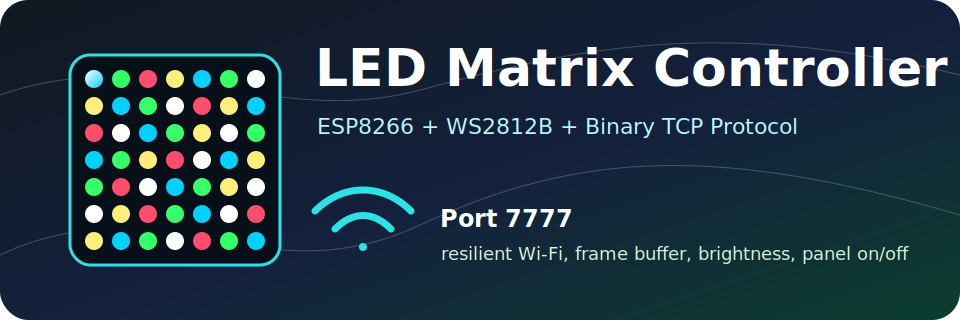

<p align="center">
  
</p>

<h1 align="center">ESP8266 LED Matrix Controller</h1>

<p align="center">
  <strong>Wi-Fi TCP firmware for an ESP8266 NodeMCU driving a WS2812B 8x8 LED matrix.</strong>
</p>

<p align="center">
  
  
  
  
</p>

<p align="center">
  <code>client app</code> -> <code>binary TCP packet</code> -> <code>ESP8266</code> -> <code>WS2812B matrix</code>
</p>

---

## ✨ What It Does

This firmware turns a small ESP8266 board into a network-controlled LED matrix
driver. It boots safely, joins Wi-Fi or opens its own fallback access point,
prints its IP address, and accepts compact binary TCP commands for real-time LED
control.

### Highlights

- 📡 **Resilient TCP server** on port `7777`
- 🌐 **Station mode** via local `include/creds.h`
- 🛜 **Access point fallback** when credentials are missing
- 💡 **WS2812B / NeoPixel output** on `D2 / GPIO4`
- 🎚️ **Brightness control**
- 🎨 **Fill, pixel, and full-frame color commands**
- 🌙 **Panel off/on** without forgetting the current image
- 🔁 **Wi-Fi reconnect and TCP listener restart**
- 🧰 **PlatformIO build, upload, monitor, and static check workflow**

---

## 🧩 Hardware

### Required

| Part | Notes |
|---|---|
| ESP8266 NodeMCU v3 | PlatformIO environment: `nodemcuv3` |
| WS2812B 8x8 matrix | 64 addressable RGB LEDs |
| External 5V PSU | Use enough current for your brightness target |
| Common ground | Required between ESP8266 and LED PSU |

### Recommended

- 🛡️ `330-470 ohm` resistor in series with data near matrix `DIN`
- 🔋 `1000 uF` capacitor across matrix `5V` and `GND`
- 📏 Short data wire
- 🎚️ Conservative brightness while testing power stability

---

## 🔌 Wiring

```text
ESP8266 D2 / GPIO4  ->  WS2812B DIN
ESP8266 GND         ->  PSU GND
PSU 5V              ->  WS2812B 5V
PSU GND             ->  WS2812B GND
```

> [!IMPORTANT]
> The shared ground is mandatory. Without it, the matrix has no stable reference
> for the ESP8266 data signal and can flicker, show wrong colors, or partially
> work.

> [!CAUTION]
> Do not power a full 64 LED matrix at high brightness from the ESP8266 5V pin.
> Use an external regulated 5V supply.

---

## 🗂️ Project Layout

```text
include/
  AppConfig.h              hardware/network constants and local creds include
  LedMatrixController.h    matrix API and stored frame model
  MatrixProtocol.h         binary TCP protocol constants
  TcpMatrixServer.h        Wi-Fi, TCP server, parser, dispatch interface

src/
  main.cpp                 Arduino setup/loop composition
  LedMatrixController.cpp  NeoPixel rendering and matrix mapping
  MatrixProtocol.cpp       checksum helper
  TcpMatrixServer.cpp      Wi-Fi retry, TCP server, packet handling

docs/
  logo.svg                 README banner

CLIENT_PROTOCOL.md         full client implementation guide
PLAN.md                    improvement/refactoring roadmap
platformio.ini             PlatformIO environment and cppcheck config
```

---

## 🚀 Quick Start

### 1. Build

```bash
pio run
```

\* `nodemcuv3` is intentionally mapped to the `nodemcuv2` board definition
because PlatformIO currently ships ESP-12E/NodeMCU as `nodemcuv2`.

### 2. Add Wi-Fi Credentials

```bash
cp include/creds.example.h include/creds.h
```

Edit `include/creds.h`:

```cpp
#pragma once

#define WIFI_SSID "your-wifi"
#define WIFI_PASSWORD "your-password"
```

`include/creds.h` is ignored by git.

### 3. Upload

```bash
pio run --target upload
```

### 4. Open Serial Monitor

```bash
pio device monitor
```

Expected boot output:

```text
ESP8266 WS2812B TCP matrix controller
LED data pin: D2 / GPIO4
Boot settle delay ms: 2000
Wi-Fi connected
Device IP: <ip-address>
TCP port: 7777
```

---

## 🛜 Wi-Fi Modes

### Station Mode

If `include/creds.h` contains a non-empty `WIFI_SSID`, the controller joins that
network and prints its assigned IP.

### Fallback Access Point

If credentials are missing or `WIFI_SSID` is empty, the controller starts an
open access point:

```text
SSID: led-matrix
IP:   192.168.4.1
TCP:  7777
```

---

## 📦 TCP Protocol

Every command is a compact binary frame:

```text
byte 0      0x4C, 'L'
byte 1      0x4D, 'M'
byte 2      protocol version, currently 0x01
byte 3      command
byte 4      payload length, 0-192
bytes 5..N  payload
last byte   XOR checksum of every previous byte
```

For complete client implementation details, response handling, reconnect
strategy, animation pacing, and Python/Node examples, see
[CLIENT_PROTOCOL.md](CLIENT_PROTOCOL.md).

### Command Map

| Command | Name | Payload | Meaning |
|---:|---|---|---|
| `0x00` | ping | empty | Check protocol/socket health |
| `0x01` | clear | empty | Set stored frame to black |
| `0x02` | brightness | `brightness` | Set global brightness `0..255` |
| `0x03` | fill | `r g b` | Fill all pixels with one RGB color |
| `0x04` | set pixel | `x y r g b` | Set one logical matrix pixel |
| `0x05` | set frame | 192 RGB bytes | Replace full physical LED frame |
| `0x06` | panel enabled | `enabled` | `0` off, nonzero on |

### Example: Fill Red

```text
4C 4D 01 03 03 FF 00 00 E3
```

```text
4C 4D       magic "LM"
01          version
03          fill command
03          payload length
FF 00 00    RGB red
E3          XOR checksum
```

---

## 🧪 Development

### Format

```bash
clang-format -i include/*.h src/*.cpp
```

### Static Check

```bash
pio check
```

### Full Local Verification

```bash
clang-format -i include/*.h src/*.cpp
pio run
pio check
```

---

## 🛠️ Troubleshooting

### Matrix flickers or only some LEDs work

- ✅ Confirm ESP8266 `GND` and LED PSU `GND` are connected.
- ✅ Confirm data wire goes to matrix `DIN`, not `DOUT`.
- ✅ Lower brightness.
- ✅ Use a stronger 5V supply.
- ✅ Add the data resistor and power capacitor.

### No serial output

- Monitor speed is `115200`.
- ESP8266 ROM boot text may appear garbled before firmware starts.

### Cannot connect over TCP

- Check serial monitor for `Device IP`.
- Confirm your computer is on the same Wi-Fi network or connected to
  `led-matrix`.
- Use TCP port `7777`.

### Wrong colors

- The firmware assumes `NEO_GRB`.
- If red/green are swapped, update the NeoPixel color order in
  `LedMatrixController.cpp`.

---

## 🗺️ Roadmap

See [PLAN.md](PLAN.md) for the active refactoring and improvement roadmap.

---

<p align="center">
  <strong>Built for small hardware, direct control, and predictable LED behavior.</strong>
</p>
